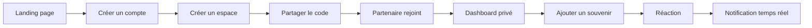
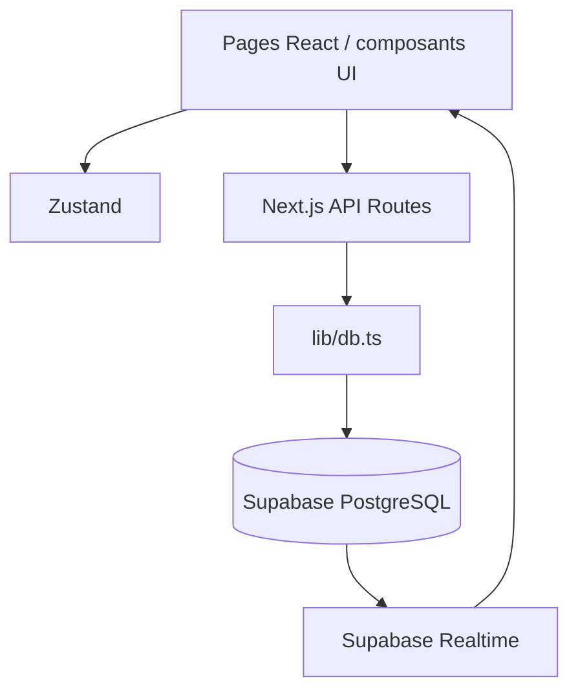

# À deux

> **Deux personnes. Une histoire. Des milliers de petits moments.**

À deux est un espace numérique privé pour construire un journal de souvenirs à deux : petits mots, humeurs, photos, réactions et notifications dans une expérience chaleureuse, premium et mobile-first.

<p align="center">
  <a href="https://github.com/TON_COMPTE/TON_REPO/actions/workflows/ci.yml">
    
  </a>
  
  
  
  
</p>

<p align="center">
  <a href="#-fonctionnalités">Fonctionnalités</a> ·
  <a href="#-démarrage">Démarrage</a> ·
  <a href="#-supabase">Supabase</a> ·
  <a href="#-architecture">Architecture</a> ·
  <a href="#-feuille-de-route">Roadmap</a>
</p>

---

## ✨ Aperçu

| Espace public | Espace privé | Journal partagé |
| --- | --- | --- |
| Landing page émotionnelle | Dashboard personnel | Timeline de souvenirs |
| Inscription et connexion | Création ou invitation | Réactions et notifications |
| Mode clair et sombre | Limité à deux personnes | Synchronisation temps réel |

> **Objectif produit :** ouvrir l'application et ressentir immédiatement _« Ici, c'est notre petit monde à nous. »_

## 🌟 Fonctionnalités

### Disponibles

- **Landing page** moderne et responsive
- **Inscription, connexion et déconnexion**
- **Création d'espace privé** avec code d'invitation
- **Limitation à deux membres** par espace
- **Journal partagé** avec ajout de petits mots et humeurs
- **Persistance Supabase** pour profils, espaces et souvenirs
- **Réactions emoji** : ❤️ 🥹 ✨
- **Notifications** lors d'un nouveau souvenir ou d'une réaction
- **Supabase Realtime** préparé pour les nouveaux souvenirs
- **Galerie, profil, secrets et dashboard** structurés pour les prochaines itérations
- **Design responsive** mobile, tablette et desktop
- **Mode clair/sombre**
- **CI GitHub Actions** avec vérification automatique du build

### En préparation

- Upload réel de photos, vidéos et fichiers audio
- Messages secrets « Ouvre quand... »
- Calendrier des souvenirs
- Streak quotidien
- Statistiques « Notre histoire »
- Supabase Auth complet et politiques RLS métier
- Résumés mensuels assistés par IA

## 🧭 Parcours utilisateur



## 🛠️ Stack technique

| Couche | Technologie |
| --- | --- |
| Interface | Next.js 16, React 19, TypeScript |
| Styles | Tailwind CSS |
| Animations | Framer Motion |
| État client | Zustand |
| API | Next.js App Router API Routes |
| Données | Supabase PostgreSQL |
| Temps réel | Supabase Realtime |
| Icônes | Lucide React |
| Qualité | GitHub Actions + `npm run build` |

## 🚀 Démarrage

### Prérequis

- Node.js 20+
- npm 10+
- Un projet Supabase pour la persistance distante

### Installation locale

```powershell
git clone https://github.com/TON_COMPTE/TON_REPO.git
cd TON_REPO
npm install
Copy-Item .env.example .env.local
npm run dev
```

L'application est disponible sur [http://localhost:3000](http://localhost:3000).

### Commandes

```powershell
npm run dev      # Développement
npm run build    # Build de production
npm start        # Serveur de production
```

## 🔐 Supabase

1. Crée un projet sur [supabase.com](https://supabase.com).
2. Ouvre le **SQL Editor**.
3. Exécute [`supabase/schema.sql`](./supabase/schema.sql).
4. Active `memories`, `reactions` et `notifications` dans la publication `supabase_realtime`.
5. Renseigne `.env.local` :

```env
NEXT_PUBLIC_SUPABASE_URL=https://YOUR_PROJECT_REF.supabase.co
NEXT_PUBLIC_SUPABASE_ANON_KEY=YOUR_ANON_KEY
SUPABASE_SERVICE_ROLE_KEY=YOUR_SERVICE_ROLE_KEY
NEXT_PUBLIC_OAUTH_CONSENT_URL=https://deux-1xd5-arielsilue520-gmailcoms-projects.vercel.app/oauth/consent
NEXT_PUBLIC_SITE_URL=https://deux-1xd5-arielsilue520-gmailcoms-projects.vercel.app
```

### Connexion Google

Dans **Supabase → Authentication → Providers → Google**, active Google et utilise l’URL de callback Supabase :

`https://ioopcordecqgkduxwlr.supabase.co/auth/v1/callback`

Dans les URLs de redirection autorisées, ajoute :

`https://deux-1xd5-arielsilue520-gmailcoms-projects.vercel.app/auth/callback`

La page `/auth/callback` échange le code OAuth Supabase, synchronise le profil Google
dans `profiles`, puis crée la session interne utilisée par les routes privées de l’application.

## 🚀 Déploiement Vercel

1. Importez le dépôt GitHub dans Vercel.
2. Ajoutez ces variables dans **Project Settings → Environment Variables** :

```env
NEXT_PUBLIC_SUPABASE_URL
NEXT_PUBLIC_SUPABASE_ANON_KEY
SUPABASE_URL
SUPABASE_ANON_KEY
SUPABASE_SERVICE_ROLE_KEY
NEXT_PUBLIC_SITE_URL
NEXT_PUBLIC_OAUTH_CONSENT_URL
```

3. Dans Supabase, ajoutez l’URL de production suivante aux **Redirect URLs** :

```text
https://deux-1xd5-arielsilue520-gmailcoms-projects.vercel.app/auth/callback
```

4. Dans Google Cloud Console, conservez cette **Authorized redirect URI** :

```text
https://ioopcordecqgkduxwlr.supabase.co/auth/v1/callback
```

5. Redéployez après toute modification des variables.

Les fichiers `.env` et `.env.local` sont exclus de GitHub. Seul `.env.example`
est destiné à être versionné.

Si Google redirige correctement mais affiche « Impossible de créer le profil Google »,
exécute à nouveau `supabase/schema.sql` ou ajoute `SUPABASE_SERVICE_ROLE_KEY` dans
les variables Vercel. Cette clé doit être la **service role key** du projet Supabase,
pas la clé anon.

## 📤 Publication GitHub

```powershell
git add .
git commit -m "Integrate Google OAuth with Supabase"
git branch -M main
git remote add origin https://github.com/TON_COMPTE/TON_REPO.git
git push -u origin main
```

Le workflow GitHub Actions lance automatiquement `npm ci` puis `npm run build`
sur les push vers `main` et les pull requests.

### Supabase OAuth Server

La page d’autorisation OAuth est disponible à :

`https://deux-1xd5-arielsilue520-gmailcoms-projects.vercel.app/oauth/consent`

Dans **Supabase → Authentication → OAuth Server**, configure :

- **OAuth 2.1 Server** : activé
- **Authorization Path** : `/oauth/consent`
- **Site URL** : `https://deux-1xd5-arielsilue520-gmailcoms-projects.vercel.app`

Le fichier [`supabase/config.toml`](./supabase/config.toml) contient aussi cette configuration
pour un environnement Supabase local. L’écran lit `authorization_id`, affiche le client et
les scopes demandés, puis appelle `approveAuthorization` ou `denyAuthorization`.

### Règles de sécurité

- Ne jamais committer `.env` ou `.env.local`.
- Ne jamais exposer `SUPABASE_SERVICE_ROLE_KEY` au navigateur.
- Ne jamais préfixer la clé service par `NEXT_PUBLIC_`.
- Les espaces et souvenirs doivent toujours être filtrés par l'espace courant.
- Les tables sensibles ont la Row Level Security activée dans le schéma initial.

> Le prototype conserve un fallback local lorsque les variables Supabase ne sont pas présentes. Pour la production, configure Supabase Auth, les politiques RLS métier et le stockage privé.

## 🧱 Architecture



### Structure principale

```text
app/
├── api/
│   ├── auth/              # Inscription, connexion, session
│   ├── memories/          # Lecture et création de souvenirs
│   ├── notifications/     # Notifications utilisateur
│   ├── reactions/         # Réactions emoji
│   └── spaces/            # Création et invitation
├── auth/                  # Pages d'authentification
├── dashboard/             # Accueil privé
├── journal/               # Timeline partagée
├── memories/              # Galerie
├── profile/               # Profil et préférences
└── secrets/               # Espace réservé aux messages secrets

components/                # Composants réutilisables
lib/
├── api/client.ts          # Client HTTP
├── db.ts                  # Accès Supabase + fallback local
├── hooks/                 # Hooks auth, notifications, realtime
└── store/                 # État global
supabase/schema.sql        # Schéma PostgreSQL initial
.github/workflows/ci.yml   # Build automatique GitHub Actions
```

## 📱 Routes

| Route | Rôle | Accès |
| --- | --- | --- |
| `/` | Présentation | Public |
| `/auth/signup` | Inscription | Public |
| `/auth/login` | Connexion | Public |
| `/auth/create-space` | Créer un espace | Authentifié |
| `/auth/join-space` | Rejoindre un espace | Authentifié |
| `/dashboard` | Vue privée | Authentifié |
| `/journal` | Souvenirs et réactions | Authentifié + espace |
| `/memories` | Galerie | Authentifié + espace |
| `/profile` | Préférences | Authentifié |
| `/secrets` | Messages verrouillés | Réservé à la prochaine phase |

## 🧪 Vérification

Avant une pull request :

```powershell
npm ci
npm run build
```

Le workflow [`CI`](./.github/workflows/ci.yml) exécute automatiquement le build sur chaque push vers `main`/`master` et chaque pull request.

## 🗺️ Feuille de route

- [x] Landing page et identité visuelle
- [x] Authentification prototype
- [x] Espaces privés à deux
- [x] Journal persistant
- [x] Réactions et notifications API
- [x] Schéma Supabase
- [x] Build CI GitHub Actions
- [ ] Upload Supabase Storage
- [ ] Supabase Auth et RLS métier complètes
- [ ] Calendrier et streak
- [ ] Messages « Ouvre quand... »
- [ ] Statistiques et résumé mensuel

## 🤝 Contribution

1. Crée une branche :

   ```powershell
   git checkout -b feat/ma-fonctionnalite
   ```

2. Effectue une modification ciblée.
3. Lance `npm run build`.
4. Ouvre une pull request en décrivant le comportement ajouté.

## 📄 Licence

Projet privé en cours de développement. Ajoute une licence open source ici si le dépôt devient public.

---

<p align="center">
  Fait avec soin pour deux personnes, un souvenir à la fois. ❤️
</p>
