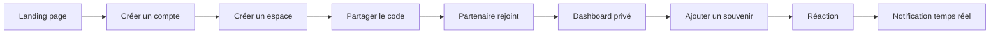
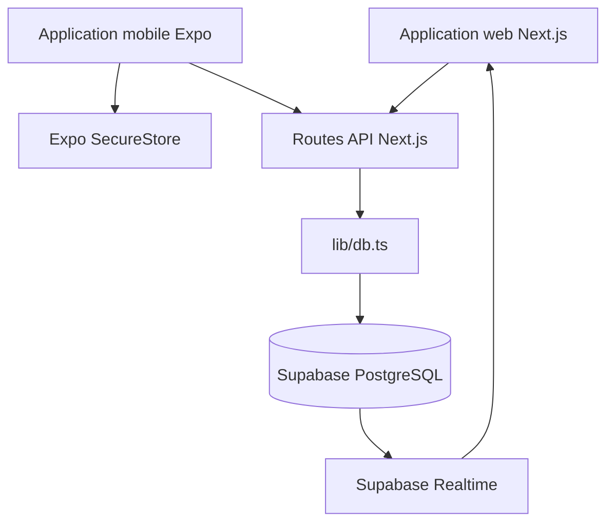

# À deux

> **Deux personnes. Une histoire. Des milliers de petits moments.**

À deux est un espace numérique privé pour construire un journal de souvenirs à deux : petits mots, humeurs, photos, réactions et notifications dans une expérience chaleureuse, premium et mobile-first.

<p align="center">
  <a href="https://github.com/BL4ZE68/--deux/actions/workflows/ci.yml">
    
  </a>
  
  
  
  
  
</p>

<p align="center">
  <a href="#-fonctionnalités">Fonctionnalités</a> ·
  <a href="#-démarrage">Démarrage</a> ·
  <a href="#-supabase">Supabase</a> ·
  <a href="#-architecture">Architecture</a> ·
  <a href="#-feuille-de-route">Roadmap</a>
</p>

---

## ✨ Aperçu

| Espace public | Espace privé | Journal partagé |
| --- | --- | --- |
| Landing page émotionnelle | Dashboard personnel | Timeline de souvenirs |
| Inscription et connexion | Création ou invitation | Réactions et notifications |
| Mode clair et sombre | Limité à deux personnes | Synchronisation temps réel |

> **Objectif produit :** ouvrir l'application et ressentir immédiatement _« Ici, c'est notre petit monde à nous. »_

## 🌟 Fonctionnalités

### Disponibles

- **Landing page** moderne et responsive
- **Inscription, connexion et déconnexion**
- **Création d'espace privé** avec code d'invitation
- **Limitation à deux membres** par espace
- **Journal partagé** avec petits mots, humeurs et photos
- **Streak quotidien** et souvenirs récents dans le tableau de bord mobile
- **Persistance Supabase** pour profils, espaces et souvenirs
- **Stockage privé Supabase** pour les photos partagées
- **Réactions emoji** : ❤️ 🥹 ✨
- **Application native Expo** pour Android et iOS
- **Journal mobile** avec recherche, filtres, humeurs, photos et réactions
- **Partage natif des invitations** et session protégée dans le stockage sécurisé
- **Notifications** lors d'un nouveau souvenir ou d'une réaction
- **Supabase Realtime** préparé pour les nouveaux souvenirs
- **Dashboard, profil et messages « Ouvre quand… »** disponibles dans l’application Expo
- **Design responsive** mobile, tablette et desktop
- **Mode clair/sombre**
- **CI GitHub Actions** avec vérification automatique du build

### En préparation

- Calendrier des souvenirs
- Statistiques avancées « Notre histoire »
- Supabase Auth complet et politiques RLS métier
- Résumés mensuels assistés par IA

## 🧭 Parcours utilisateur


```mermaid
flowchart LR
  A[Landing page] --> B[Créer un compte]
  B --> C[Créer un espace]
  C --> D[Partager le code]
  D --> E[Partenaire rejoint]
  E --> F[Dashboard privé]
  F --> G[Ajouter un souvenir]
  G --> H[Réaction]
  H --> I[Notification temps réel]
```

## 🛠️ Stack technique

| Couche | Technologie |
| --- | --- |
| Application mobile | Expo SDK 57, React Native, Expo Router, TypeScript |
| Application web | Next.js 16, React 19, Tailwind CSS |
| API | Routes API Next.js App Router, partagées entre le web et le mobile |
| Session mobile | Expo SecureStore |
| Données | Supabase PostgreSQL |
| Temps réel | Supabase Realtime |
| Qualité | GitHub Actions, build web et export Android |

## 🚀 Démarrage

### Prérequis

- Node.js 20+
- npm 10+
- Un projet Supabase pour la persistance distante

### Installation locale

```powershell
git clone https://github.com/BL4ZE68/--deux.git
Set-Location .\--deux
npm ci
npm ci --prefix mobile
Copy-Item .env.example .env.local
Copy-Item mobile\.env.example mobile\.env
```

Configure les variables Supabase dans `.env.local`, puis lance l’API dans un
terminal :

```powershell
npm run api:dev
```

L’application Expo démarre dans un deuxième terminal :

```powershell
npm run dev
```

Scanne le QR code avec Expo Go. Le site web Next.js reste disponible séparément
avec `npm run web:dev` sur [http://localhost:3000](http://localhost:3000).

### Application Expo

Dans `mobile/.env`, remplace `EXPO_PUBLIC_API_URL` par l’adresse du serveur Next.js :

- Téléphone physique : l’adresse IPv4 de ton ordinateur sur le même réseau Wi-Fi, par exemple `http://192.168.1.25:3000`.
- Émulateur Android : `http://10.0.2.2:3000`.
- Simulateur iOS : `http://localhost:3000`.

Le serveur API doit être démarré et accessible depuis l’appareil. Sur un téléphone
physique, ouvre le port 3000 dans le pare-feu local si nécessaire. Lance
l’application avec `npm run dev`. `npm run mobile:android` et
`npm run mobile:ios` démarrent aussi Expo sur un émulateur/simulateur. Les photos partagées passent par
le bucket Supabase privé `memories` et nécessitent `SUPABASE_SERVICE_ROLE_KEY`
côté serveur. Cette clé ne doit jamais être ajoutée aux variables `EXPO_PUBLIC_*`.

### Commandes

```powershell
npm run dev        # Démarrer l’application Expo
npm run api:dev    # Démarrer le serveur API sur le réseau local
npm run web:dev    # Démarrer le site Next.js
npm run build      # Build de production du site Next.js
npm start          # Serveur web de production
npm run mobile:android
npm run mobile:ios
```

## 🔐 Supabase

1. Crée un projet sur [supabase.com](https://supabase.com).
2. Ouvre le **SQL Editor**.
3. Exécute [`supabase/schema.sql`](./supabase/schema.sql).
4. Active `memories`, `reactions` et `notifications` dans la publication `supabase_realtime`.
5. Le script crée aussi le bucket privé `memories`. Les uploads photo, vidéo et audio
   passent par `/api/memories` et nécessitent `SUPABASE_SERVICE_ROLE_KEY` côté serveur.
6. Renseigne `.env.local` :

```env
NEXT_PUBLIC_SUPABASE_URL=https://YOUR_PROJECT_REF.supabase.co
NEXT_PUBLIC_SUPABASE_ANON_KEY=YOUR_ANON_KEY
SUPABASE_SERVICE_ROLE_KEY=YOUR_SERVICE_ROLE_KEY
NEXT_PUBLIC_OAUTH_CONSENT_URL=https://YOUR_DOMAIN/oauth/consent
NEXT_PUBLIC_SITE_URL=https://YOUR_DOMAIN
```

### Connexion Google

Dans **Supabase → Authentication → Providers → Google**, active Google et utilise l’URL de callback Supabase :

`https://YOUR_PROJECT_REF.supabase.co/auth/v1/callback`

Dans les URLs de redirection autorisées, ajoute l’adresse de ton site :

`https://YOUR_DOMAIN/auth/callback`

La page `/auth/callback` échange le code OAuth Supabase, synchronise le profil Google
dans `profiles`, puis crée la session interne utilisée par les routes privées de l’application.

## 🚀 Déploiement Vercel

1. Importez le dépôt GitHub dans Vercel.
2. Ajoutez ces variables dans **Project Settings → Environment Variables** :

```env
NEXT_PUBLIC_SUPABASE_URL
NEXT_PUBLIC_SUPABASE_ANON_KEY
SUPABASE_URL
SUPABASE_ANON_KEY
SUPABASE_SERVICE_ROLE_KEY
NEXT_PUBLIC_SITE_URL
NEXT_PUBLIC_OAUTH_CONSENT_URL
```

3. Dans Supabase, ajoutez l’URL de votre site aux **Redirect URLs** :

```text
https://YOUR_DOMAIN/auth/callback
```

4. Dans Google Cloud Console, conservez cette **Authorized redirect URI** :

```text
https://YOUR_PROJECT_REF.supabase.co/auth/v1/callback
```

5. Redéployez après toute modification des variables.

Les fichiers `.env` et `.env.local` sont exclus de GitHub. Seul `.env.example`
est destiné à être versionné.

Si Google redirige correctement mais affiche « Impossible de créer le profil Google »,
exécute à nouveau `supabase/schema.sql` ou ajoute `SUPABASE_SERVICE_ROLE_KEY` dans
les variables Vercel. Cette clé doit être la **service role key** du projet Supabase,
pas la clé anon.

## 📤 Publication GitHub

```powershell
git add .
git commit -m "Describe your change"
git push
```

Le workflow GitHub Actions vérifie le build web et le type-check/export Android
de l’application Expo sur les push vers `main` et les pull requests.

### Supabase OAuth Server

La page d’autorisation OAuth est disponible à :

`https://YOUR_DOMAIN/oauth/consent`

Dans **Supabase → Authentication → OAuth Server**, configure :

- **OAuth 2.1 Server** : activé
- **Authorization Path** : `/oauth/consent`
- **Site URL** : `https://YOUR_DOMAIN`

Le fichier [`supabase/config.toml`](./supabase/config.toml) contient aussi cette configuration
pour un environnement Supabase local. L’écran lit `authorization_id`, affiche le client et
les scopes demandés, puis appelle `approveAuthorization` ou `denyAuthorization`.

### Règles de sécurité

- Ne jamais committer `.env` ou `.env.local`.
- Ne jamais exposer `SUPABASE_SERVICE_ROLE_KEY` au navigateur.
- Ne jamais préfixer la clé service par `NEXT_PUBLIC_`.
- Les espaces et souvenirs doivent toujours être filtrés par l'espace courant.
- Les tables sensibles ont la Row Level Security activée dans le schéma initial.

> Le prototype conserve un fallback local lorsque les variables Supabase ne sont pas présentes. Pour la production, configure Supabase Auth, les politiques RLS métier et le stockage privé.

## 🧱 Architecture


```mermaid
flowchart TB
  Web[Application web Next.js]
  Native[Application mobile Expo]
  Secure[Expo SecureStore]
  API[Routes API Next.js]
  DB[lib/db.ts]
  Supabase[(Supabase PostgreSQL)]
  Realtime[Supabase Realtime]

  Web --> API
  Native --> Secure
  Native --> API
  API --> DB
  DB --> Supabase
  Supabase --> Realtime
  Realtime --> Web
```

### Structure principale

```text
app/
├── api/
│   ├── auth/              # Inscription, connexion, session
│   ├── memories/          # Lecture et création de souvenirs
│   ├── notifications/     # Notifications utilisateur
│   ├── reactions/         # Réactions emoji
│   └── spaces/            # Création et invitation
├── auth/                  # Pages d'authentification
├── dashboard/             # Accueil privé
├── journal/               # Timeline partagée
├── memories/              # Galerie
├── profile/               # Profil et préférences
└── secrets/               # Messages à ouverture différée

components/                # Composants réutilisables
mobile/                    # Application native Expo Router
├── app/                   # Connexion, accueil, journal, lettres et profil
├── components/            # Composants d'interface React Native
├── context/               # Session persistée dans Expo SecureStore
└── lib/api.ts             # Client des routes API partagées
lib/
├── api/client.ts          # Client HTTP
├── db.ts                  # Accès Supabase + fallback local
├── hooks/                 # Hooks auth, notifications, realtime
└── store/                 # État global
supabase/schema.sql        # Schéma PostgreSQL initial
.github/workflows/ci.yml   # Build automatique GitHub Actions
```

## 📱 Routes

| Route | Rôle | Accès |
| --- | --- | --- |
| `/` | Présentation | Public |
| `/auth/signup` | Inscription | Public |
| `/auth/login` | Connexion | Public |
| `/auth/create-space` | Créer un espace | Authentifié |
| `/auth/join-space` | Rejoindre un espace | Authentifié |
| `/dashboard` | Vue privée | Authentifié |
| `/journal` | Souvenirs et réactions | Authentifié + espace |
| `/memories` | Galerie | Authentifié + espace |
| `/profile` | Préférences | Authentifié |
| `/secrets` | Messages verrouillés | Disponible sur le web et dans Expo |

L’application Expo propose les onglets **Notre espace**, **Journal**, **Ouvre quand…**
et **Nous**, ainsi que la création de souvenirs texte, humeur et photo. Les lettres
programmées restent cachées côté serveur jusqu’à leur date d’ouverture pour leur destinataire.

## 🧪 Vérification

Avant une pull request :

```powershell
npm ci
npm run build
npm ci --prefix mobile
npm --prefix mobile run check
npm --prefix mobile run export
```

Le workflow [`CI`](./.github/workflows/ci.yml) exécute automatiquement le build sur chaque push vers `main`/`master` et chaque pull request.

## 🗺️ Feuille de route

- [x] Landing page et identité visuelle
- [x] Authentification prototype
- [x] Espaces privés à deux
- [x] Journal persistant
- [x] Réactions et notifications API
- [x] Schéma Supabase
- [x] Build CI GitHub Actions
- [x] Upload Supabase Storage privé pour photo, vidéo et audio
- [x] Application mobile native Expo Router
- [x] Journal mobile avec humeur, photo, recherche, filtres et réactions
- [x] Invitations partagées avec les fonctions natives du téléphone
- [ ] Supabase Auth et RLS métier complètes
- [x] Streak quotidien
- [x] Messages « Ouvre quand... » avec date d’ouverture native
- [ ] Calendrier des souvenirs
- [ ] Statistiques et résumé mensuel
- [ ] Notifications mobiles poussées

## 🤝 Contribution

1. Crée une branche :

   ```powershell
   git checkout -b feat/ma-fonctionnalite
   ```

2. Effectue une modification ciblée.
3. Lance `npm run build`.
4. Ouvre une pull request en décrivant le comportement ajouté.

## 📄 Licence

Ce dépôt ne contient pas encore de fichier de licence. Tous droits réservés ; demande l’autorisation avant toute réutilisation ou redistribution.

---

<p align="center">
  Fait avec soin pour deux personnes, un souvenir à la fois. ❤️
</p>
